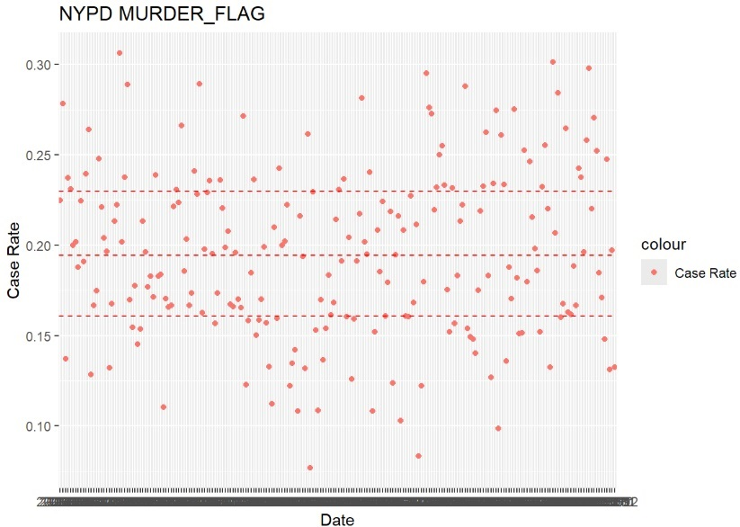
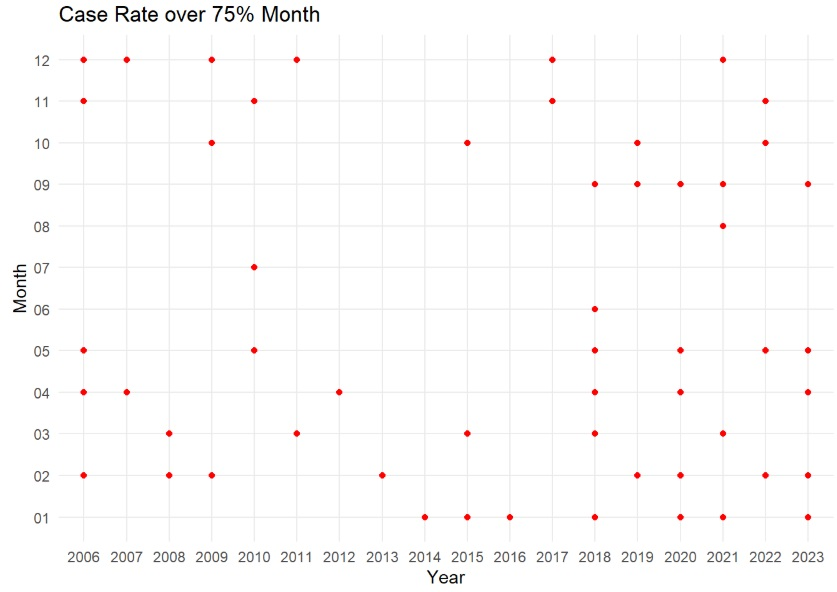
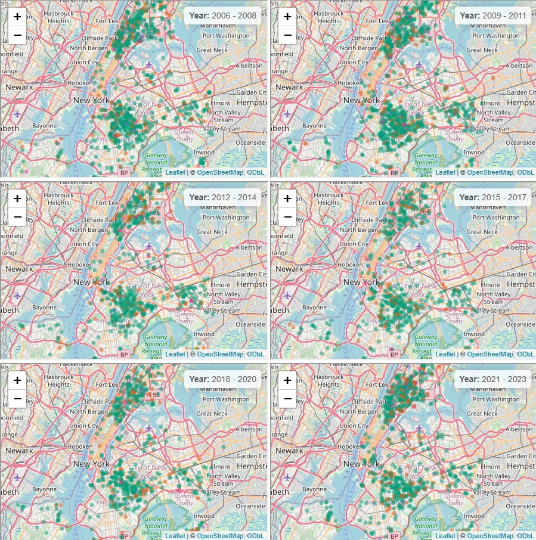
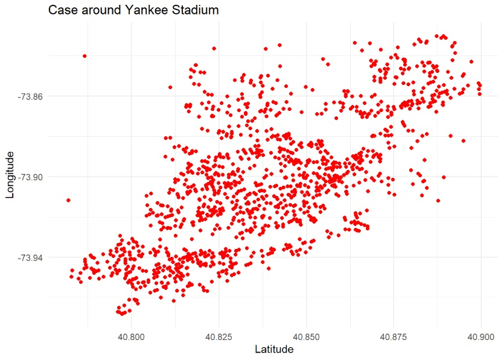
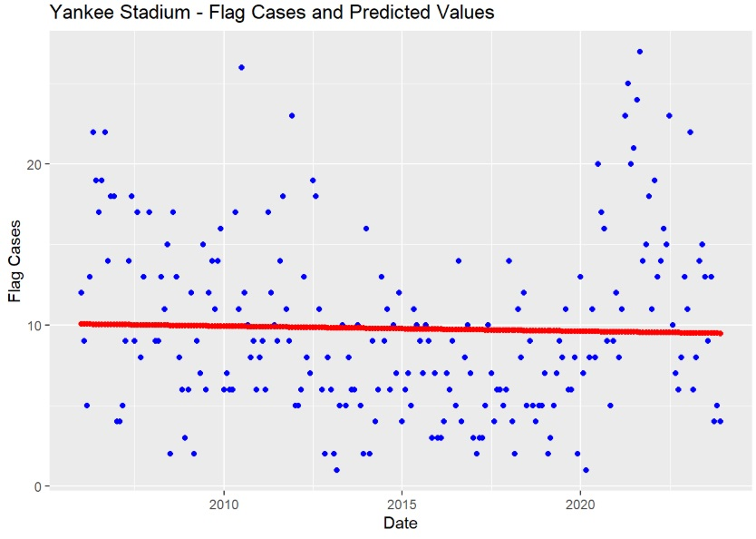
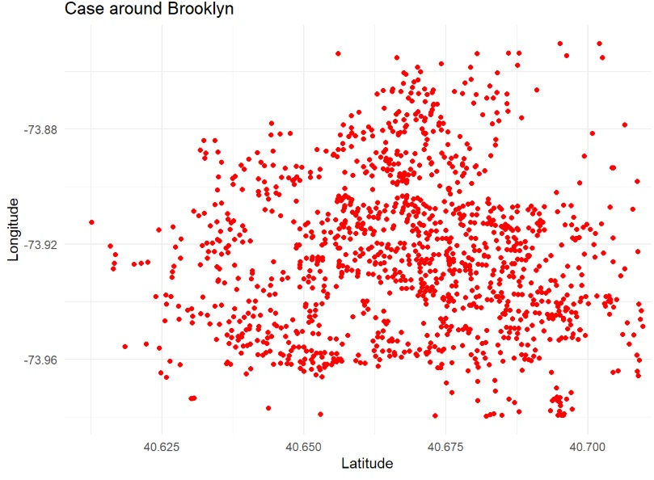
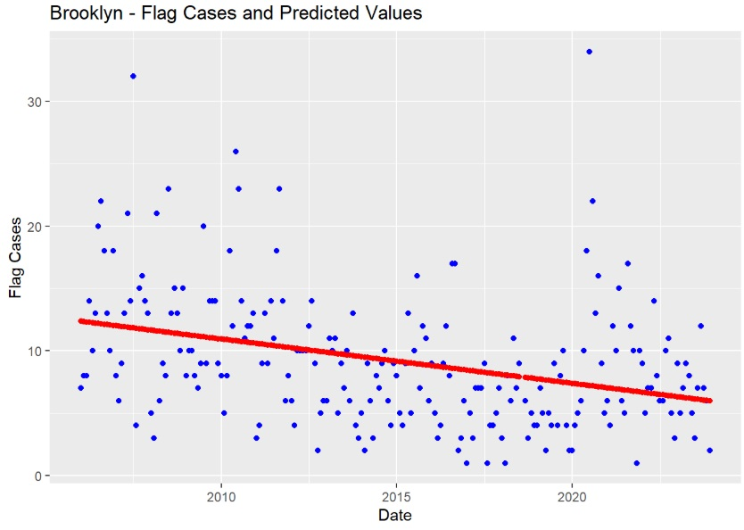

# Research Analysis Report: NYPD Shooting Incident Data Analysis

## Abstract

This study analyzes shooting incident data provided by the New York City Police Department (NYPD), focusing on violent crime trends and geographic distribution associated with "MURDER_FLAG" incidents. It also explores potential crime drivers. The analysis covers the period from 2006 to 2023, utilizing data cleaning, statistical computation, and visualization to provide insights for crime prevention strategies.

### Analysis Methods
1. Data Cleaning：
    - Removed redundant fields (e.g., incident keys and coordinate codes).
    - Standardized date formats for time-series analysis.
      
2. Data Modeling and Visualization：
    - Calculated "MURDER_FLAG" case proportions and identified months exceeding the 75th percentile threshold.
    - Conducted geographic distribution analysis, focusing on Yankee Stadium and Brooklyn areas.
    - Used linear regression models to predict violent crime trends.

### Analysis Results
1. Time Trend Analysis
    - The monthly proportion of "MURDER_FLAG" cases typically ranged from 16% to 23%.
    - Since 2018, this proportion has significantly increased, with several months exceeding the 75th percentile threshold of 23%, indicating a rising trend in violent crime.
      

    
2. High-Proportion Months
    - In 2018, 2020, 2021, and 2023, 5 to 6 months each year had case proportions exceeding the historical average (3 months with proportions over 75%).

        |  year  | count |
        |  :----:  | :----:  |
        |  2006  |  5  |
        |  2018  |  6  |
        |  2020  |  5  |
        |  2021  |  5  |
        |  2022  |  4  |
        |  2023  |  5  |

    - These years might have been influenced by specific events or socio-economic factors, requiring further investigation.

3. Geographic Visualization
    - Leaflet maps were used to visualize shooting incidents in New York, showing temporal changes in the geographic distribution of "MURDER_FLAG" cases.
    - The maps reveal concentrated case distributions and density variations across different regions.
      
    

4. Geographic Distribution
    - Yankee Stadium Area：
      - High and stable case density, potentially linked to local activities.
      - Linear regression indicates persistently high levels of violent crime, necessitating enhanced law enforcement efforts.
      
    
    

    - Brooklyn Area：
      - Case density has steadily declined, reflecting the effectiveness of safety measures.
      - Regression analysis shows continued improvement in crime rates, suggesting the need to sustain successful strategies.
      
    
    

### Conclusions and Recommendations
1. Crime Trend Observations：

    - Since 2018, violent crime has risen in New York City, particularly in specific areas.。
    - Further research is recommended to examine crime drivers, such as socio-economic stress and law enforcement resource allocation。
      
2. Regional Focus：

    - The high crime rate in the Yankee Stadium area demands attention and may be influenced by large-scale events.
    - Brooklyn's success provides potential strategies for reducing crime rates elsewhere.
      
3. Data Limitations and Biases：

    - The data may have incomplete or biased records (e.g., statistical methods or recording errors).
    - Analytical results may be influenced by subjective assumptions, necessitating the inclusion of more socio-economic data for validation.

### Future Research Directions
1. Introduce multivariate analysis, considering factors like income levels, education, and unemployment rates.
2. Use machine learning techniques to improve crime rate prediction models.
3. Evaluate the effectiveness of current law enforcement strategies and propose targeted improvements.
