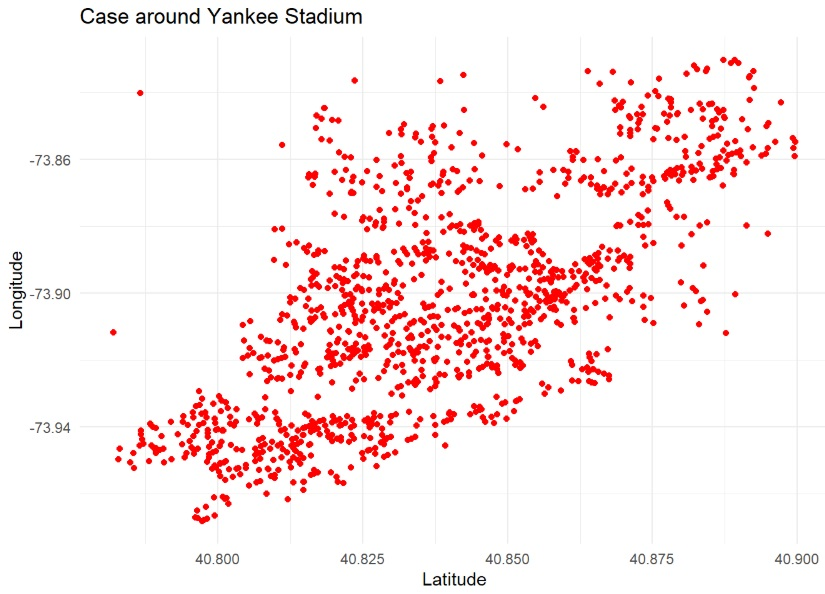
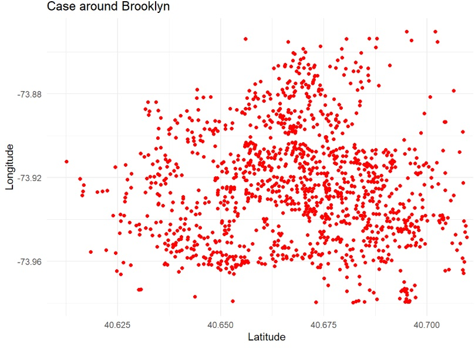
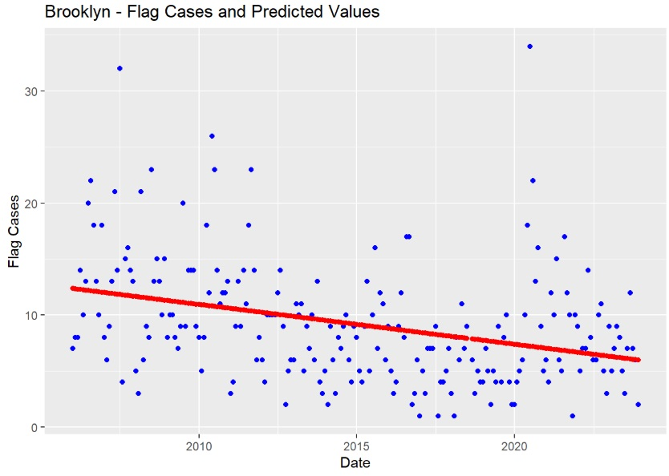

# 研究分析報告：NYPD 槍擊事件數據分析

## 本研究分析了紐約市警察局 (NYPD) 提供的槍擊事件數據，重點關注與「MURDER_FLAG」相關的暴力犯罪趨勢及其地理分布，並探討可能的犯罪驅動因素。分析範圍涵蓋2006年至2023年，透過數據清理、統計計算及可視化進行研究，提供了針對犯罪防控的洞察。

### 分析方法
1. 數據清理：
    - 移除冗餘欄位（如事件鍵值和座標代碼）。
    - 標準化日期格式，便於時間序列分析。
      
2. 數據建模與視覺化：
    - 計算「MURDER_FLAG」案例比例並識別超過75%分位數的月份。
    - 地理分布分析包括紐約的洋基體育館和布魯克林地區。
    - 使用線性回歸模型預測暴力犯罪趨勢。

### 分析結果
1. 時間趨勢分析
    - 每月「MURDER_FLAG」案例比例通常在16%至23%之間。
    - 自2018年起，該比例顯著增加，多個月份超過75%分位數的23%閾值，顯示暴力犯罪有上升趨勢。
      

    
2. 高比例月份
    - 2018、2020、2021、2023年各有5至6個月份的案例比例超過歷史平均值（3個月份的案件比例超過75%）。

        |  year  | count |
        |  :----:  | :----:  |
        |  2006  |  5  |
        |  2018  |  6  |
        |  2020  |  5  |
        |  2021  |  5  |
        |  2022  |  4  |
        |  2023  |  5  |

    - 這些年份可能受到特殊事件或社會經濟因素影響，需進一步調查。

3. 地圖可視化
    - 使用 Leaflet 生成紐約槍擊事件地圖，展示「MURDER_FLAG」案例隨時間的地理變化。
    - 地圖顯示了案件的集中分布及其在不同地區的密度變化。
      
    

4. 地理分布
    - 洋基體育館區域：
      - 案例密度高且穩定，可能與當地活動相關。
      - 線性回歸顯示暴力犯罪的高水平持續存在，需強化執法。
      
    
    

    - 布魯克林地區：
      - 案例密度逐漸下降，反映安全措施的有效性。
      - 回歸分析顯示犯罪率持續改善，需延續成功策略。
      
    
    

### 結論與建議
1. 犯罪趨勢觀察：

    - 自2018年起，紐約市的暴力犯罪有所上升，特別是在特定地區。
    - 建議進一步研究犯罪驅動因素，例如社會經濟壓力、執法資源分配等。
      
2. 地區重點：

    - 洋基體育館區域的高犯罪率需要關注，並可能與大型活動的影響有關。
    - 布魯克林的成功案例提供了降低犯罪率的潛在策略參考。
      
3. 數據限制與偏差：

    - 數據可能存在不完整性或偏差（如統計方法或記錄誤差）。
    - 分析結果可能受主觀假設影響，需加入更多社會經濟數據進行驗證。

### 未來研究方向
1. 引入多變量分析，考慮收入水平、教育程度和失業率等因素。
2. 使用機器學習技術改進犯罪率預測模型。
3. 評估現有執法策略的有效性並提出針對性改進建議。
